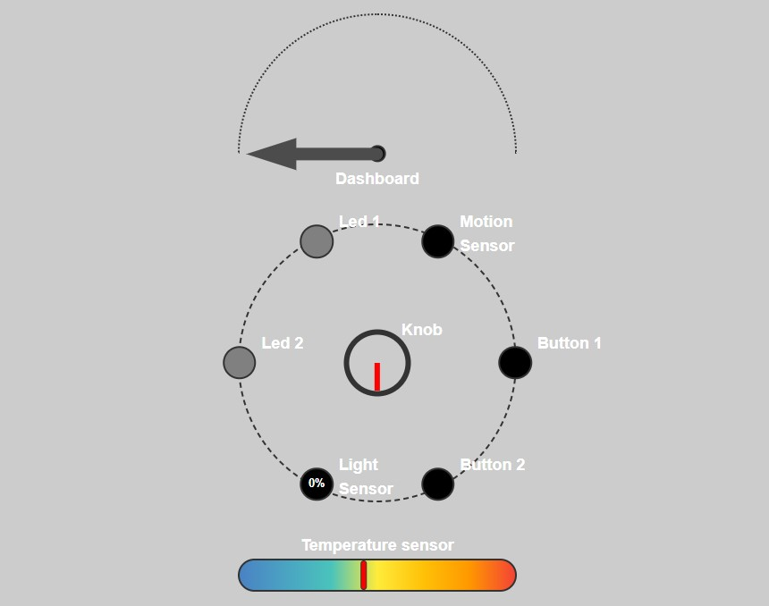
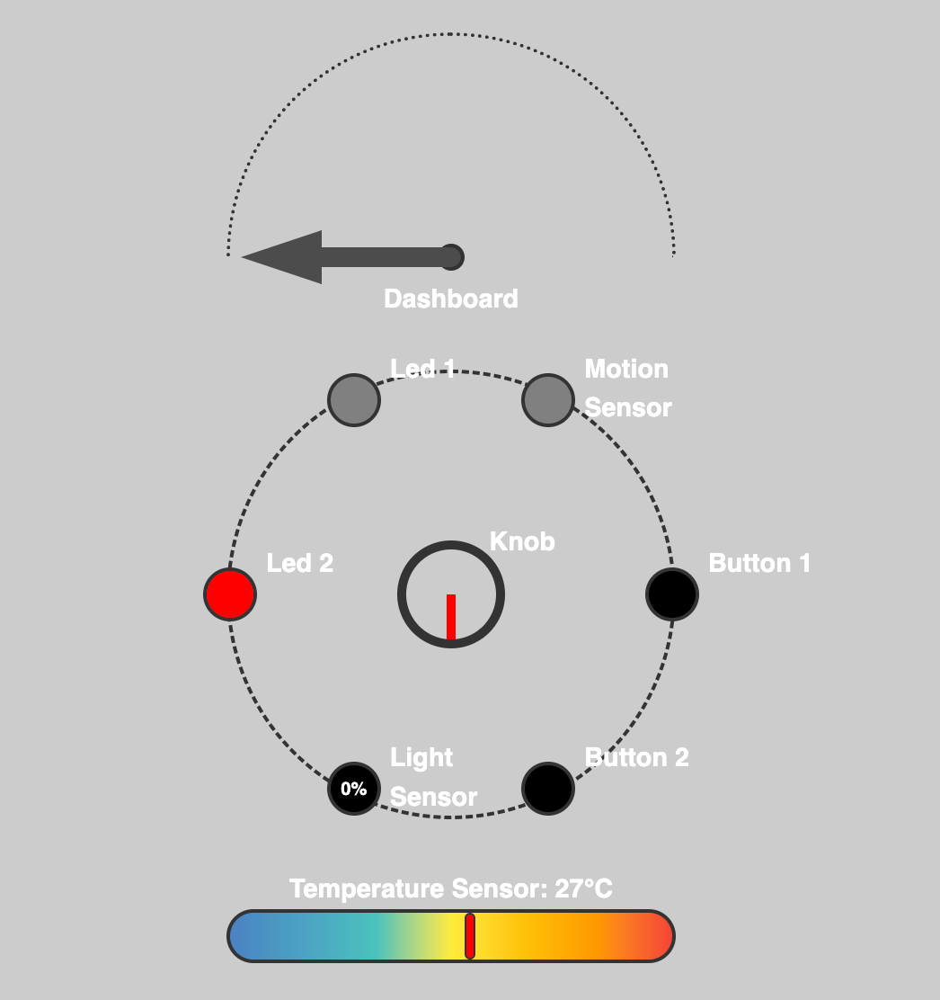
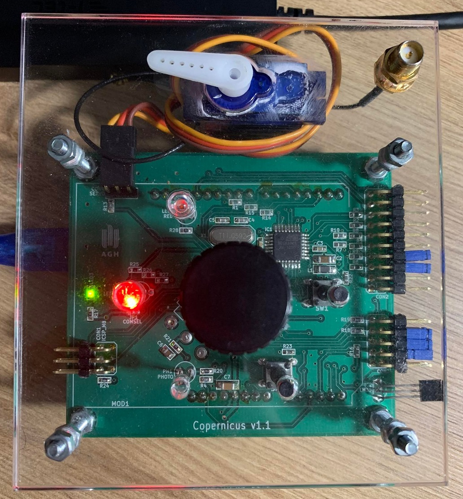

# IoT Project: Integration of AGH Copernicus with RaspberryPi 4
The goal of the project was to create a simple app based on integration of AGH Copernicus board with RaspberryPi 4. It 
displays board's current state and allows users to control all of its elements through a user-friendly interface.

## Implementation
Project follows the Observer design pattern. To communicate with the Copernicus board we used the `AppController` class 
inheriting from `CopernicusObserver`. It contains function `update()` which receives updates from `APICopernicus` about 
subscribed events and passes them to corresponding handlers in order to display changes in the UI. Analogical 
subscription handlers have been created in `APICopernicus` allowing changes made in UI to be displayed also on the 
actual Copernicus board.

## Usage
App can be launched from `main()` function in file `app.py`. Example usage of the app can be found in `api/examples` 
directory.

In UI it's possible to change angle of Dashboard (using Knob), state of Led1 and Led2 (using respectively Button1 and 
Button2) and color of Led2 (by clicking on it).

### Methods
`APICopernicus` class contains methods that can be used manually to change or read state of each element of the AGH 
Copernicus board, such as:
- `set_dashboard_angle(self, angle: int)` - sets dashboard to given angle
  - parameters:
    - `angle` - expected values in range [0, 31]
  - returns `True` if operation was successful, `False` otherwise

- `set_led1_state(self, state: bool)` - turns Led1 on and off
  - parameters:
    - `state` - `True` turns Led1 on, `False` turns it off
  - returns `True` if operation was successful, `False` otherwise

- `set_led2_color(self, red: int, green: int, blue: int)` - sets color of Led2 to given RGB
  - parameters: 
    - `red`, `green`, `blue` - expected value of each in range [0, 3]
  - returns `True` if operation was successful, `False` otherwise

- `get_ambient_light(self)`
  - returns value of ambient light in range [0, 63]

- `get_knob_position(self)`
  - returns value of the knob position in range [0, 63]

- `get_temperature(self)`
  - returns temperature measured in Celsius in range [10, 41.5]

- `get_motion_state(self)`
  - returns `True` if motion is detected, `False` otherwise

- `get_button1_state(self)`
  - returns `True` if the Button1 is pressed, `False` otherwise

- `get_button2_state(self)`
  - returns `True` if the Button2 is pressed, `False` otherwise

## Example
|                UI                |                 Copernicus board                 |
|:--------------------------------:|:------------------------------------------------:|
|  |  |

## Authors
- Dawid Liberda
- Mateusz Nowak
- Bogumiła Papiernik
